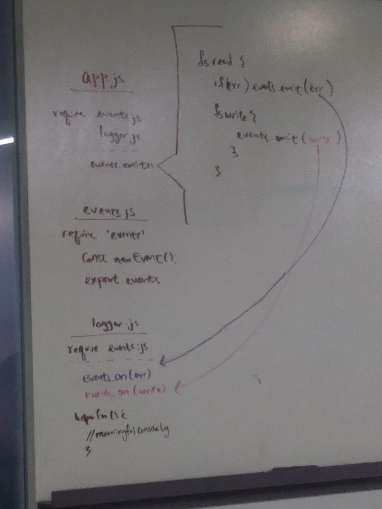

# LAB - 16

## Event Driven Applications

### Author: Joseph Hangarter

### Links and Resources
* [submission PR](http://xyz.com)
* [travis](http://xyz.com)

#### Documentation
* [jsdoc](http://xyz.com) (Server assignments)

### Modules
#### `events.js` - Events instance
#### `logger.js` - listening for emits
#### `app.js` - where the emits are occuring in read and write files
#### test.txt - where the text becomes uppercased

#### Running the app
* `npm start`
* `node app.js`
  
#### Tests
* `npm test`

#### UML

